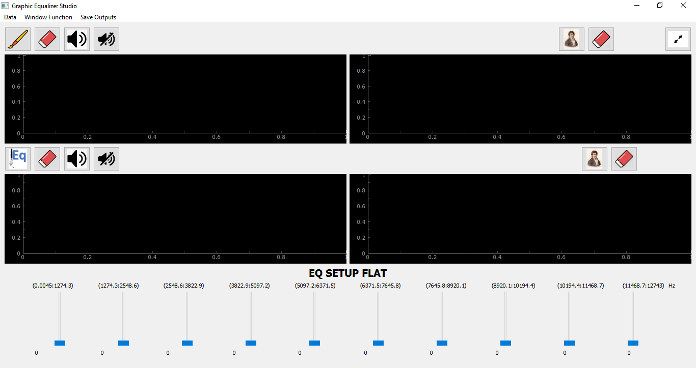

# &emsp;&emsp;&emsp;&emsp;**`Equalizer`**
# **`Team`** :
### 1- Zeinab Walid &emsp;&emsp;&emsp;&emsp;2-Mohammed El-Sayed
### 3- Marina Maher

# **`ABOUT`**
### We have implemented an equalizer progam that take a sound file and make fourier transform for it and then make user use sliders to change the weight of each frequency to change the sound and take only specific componants.   

# **`OUTPUT`**
### **`The final view of the program.`**

# **`HOW TO USE`**
### you must install all dependences that is not included in your device and just run any file by typing in terminal `python file_name.py.`

